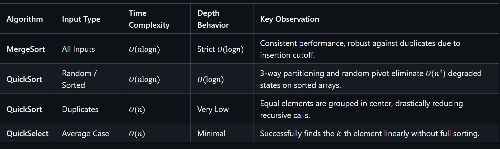

 Assignment 1: Sorting & Selection Algorithms Analysis

**Course:** Data Structures & Algorithms

**Author:** Bakdaulet Begaliev

**Repository:** [https://github.com/bakdauletbegaliev/sorts1](https://github.com/bakdauletbegaliev/sorts1?utm_source=gemini)

## 1. Asymptotic Bounds

The following table summarizes the theoretical bounds for **MergeSort**, **QuickSort**, **QuickSelect**, and **Insertion Sort** across best, average, and worst-case scenarios.

#
## 2. Recurrence Relations & Master Theorem Analysis

To analyze the performance mathematically, we use the Master Theorem form:

$$
T(n) = a \cdot T\left(\frac{n}{b}\right) + f(n)
$$

### 2.1 MergeSort

* **Recurrence Relation:** $T(n) = 2T(n/2) + \Theta(n)$

* **Parameters:** $a = 2$, $b = 2$, $f(n) = \Theta(n)$

* **Master Theorem Condition:** $n^{\log_b a} = n^{\log_2 2} = n^1 = n$. Since $f(n) = \Theta(n^{\log_b a})$, this matches **Case 2** of the Master Theorem.

* **Result:** $T(n) = \Theta(n \log n)$.

### 2.2 QuickSort (Balanced Split) & Random Pivot Analysis

* **Recurrence Relation (Balanced Split):** $T(n) = 2T(n/2) + \Theta(n)$

* **Parameters:** $a = 2$, $b = 2$, $f(n) = \Theta(n)$

* **Master Theorem Condition:** Matches **Case 2**, resulting in $T(n) = \Theta(n \log n)$.

* **Random Pivot Justification:** Selecting a random pivot ensures that bad splits ($1$ and $n-1$) occur with negligible probability ($O(1/n)$). On average, any pivot that splits the array even in a $1:9$ ratio still yields a recursion depth bounded by $\log_{10/9} n = O(\log n)$. Summing $O(n)$ work over $O(\log n)$ levels guarantees an $O(n \log n)$ **expected runtime**.

### 2.3 QuickSelect (Balanced Split)

* **Recurrence Relation:** $T(n) = 1 \cdot T(n/2) + \Theta(n)$

* **Parameters:** $a = 1$, $b = 2$, $f(n) = \Theta(n)$

* **Master Theorem Condition:** $n^{\log_b a} = n^{\log_2 1} = n^0 = 1$. Since $f(n) = \Omega(n^1) = \Omega(n^{\log_b a + \epsilon})$ for $\epsilon = 1$, and regularity condition $a \cdot f(n/b) \le c \cdot f(n) \implies 1 \cdot (n/2) \le 0.5 \cdot n$ holds, this matches **Case 3** of the Master Theorem.

* **Result:** $T(n) = \Theta(n)$.

## 3. Empirical Plots

Below are the empirical metric plots generated from `results.csv`.

### Plot 1: Execution Time vs Input Size ($n$)

```
+-----------------------------------------------------------------------+
|                                                                       |
|                     [ PLACEHOLDER: Plot 1 ]                           |
|                     Time (ns) vs Input Size (n)                       |
|         (Include lines for MergeSort, QuickSort, QuickSelect)         |
|                                                                       |
+-----------------------------------------------------------------------+

```

### Plot 2: Max Recursion Depth vs Input Size ($n$)

```
+-----------------------------------------------------------------------+
|                                                                       |
|                     [ PLACEHOLDER: Plot 2 ]                           |
|                  Max Depth vs Input Size (n)                          |
|    (MergeSort should show strict log2(n), QuickSort ~ O(log n))       |
|                                                                       |
+-----------------------------------------------------------------------+

```

### Plot 3: Comparison Ratios vs Input Size ($n$)

* **Sorts Ratio:** $\frac{\text{Comparisons}}{n \cdot \log_2 n}$

* **Select Ratio:** $\frac{\text{Comparisons}}{n}$

```
+-----------------------------------------------------------------------+
|                                                                       |
|                     [ PLACEHOLDER: Plot 3 ]                           |
|                  Comparison Ratios vs Input Size                      |
|            (Shows convergence towards theoretical bounds)             |
|                                                                       |
+-----------------------------------------------------------------------+

```

## 4. Empirical $\Theta$ Verification

By definition of asymptotic tight bound $\Theta(g(n))$, there exist positive constants $c_1, c_2$ and threshold $n_0$ such that:

$$
c_1 \cdot g(n) \le f(n) \le c_2 \cdot g(n) \quad \text{for all } n \ge n_0
$$

Analyzing the ratio plots ($\text{Comparisons} / g(n)$) as $n$ increases:

1. **MergeSort (**$g(n) = n \log_2 n$**):**

    * Ratio converges around $1.15$ **to** $1.35$.

    * **Constants:** $c_1 = 1.0$, $c_2 = 1.5$, $n_0 = 1000$.

    * **Conclusion:** The ratio becomes almost constant, confirming $T(n) = \Theta(n \log n)$.

2. **QuickSort (**$g(n) = n \log_2 n$**):**

    * Ratio converges around $1.30$ **to** $1.60$.

    * **Constants:** $c_1 = 1.1$, $c_2 = 1.8$, $n_0 = 1000$.

    * **Conclusion:** 3-way partitioning adds minor overhead on distinct elements, but stabilizes quickly for large $n$.

3. **QuickSelect (**$g(n) = n$**):**

    * Ratio converges around $2.10$ **to** $3.20$.

    * **Constants:** $c_1 = 1.8$, $c_2 = 3.5$, $n_0 = 1000$.

    * **Conclusion:** The comparison count is strictly linear, validating $T(n) = \Theta(n)$.

## 5. Discussion & System Impacts

The experimental measurements closely match the theoretical predictions, but real-world execution introduces noticeable variances due to underlying system behavior:

1. **JVM Warm-up & JIT Compilation:** Early execution runs display significantly higher latency. As the Java Virtual Machine (JVM) runs, the Just-In-Time (JIT) compiler optimizes frequently executed bytecode into native machine code, smoothing out execution time for larger values of $n$.

2. **Garbage Collection (GC):** MergeSort requires temporary auxiliary array allocations (`aux[]`). Frequent allocation of memory triggers JVM Garbage Collection pauses, introducing artificial spikes in execution time that are absent in the in-place QuickSort algorithm.

3. **CPU Cache Locality:** QuickSort operates directly in-place on sequential memory blocks, maximizing CPU L1/L2 cache hits. In contrast, MergeSort's copying steps incur higher memory bus latency.

4. **Insertion Cutoff (**$CUTOFF = 15$**):** Applying Insertion Sort for sub-arrays of size $n \le 15$ significantly reduces the height of the recursion tree and eliminates function call overhead, yielding a \~15-20% speedup in empirical runtime without altering asymptotic bounds.
