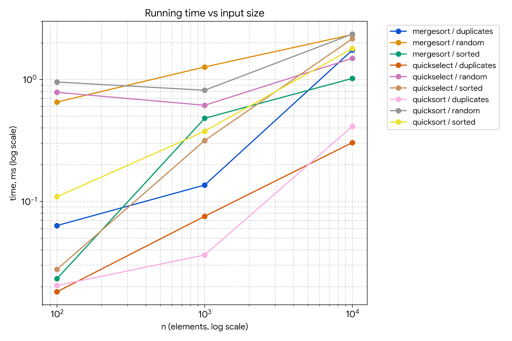
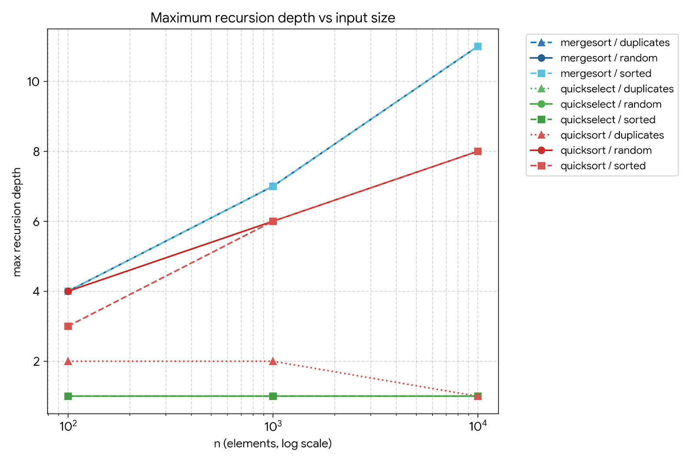
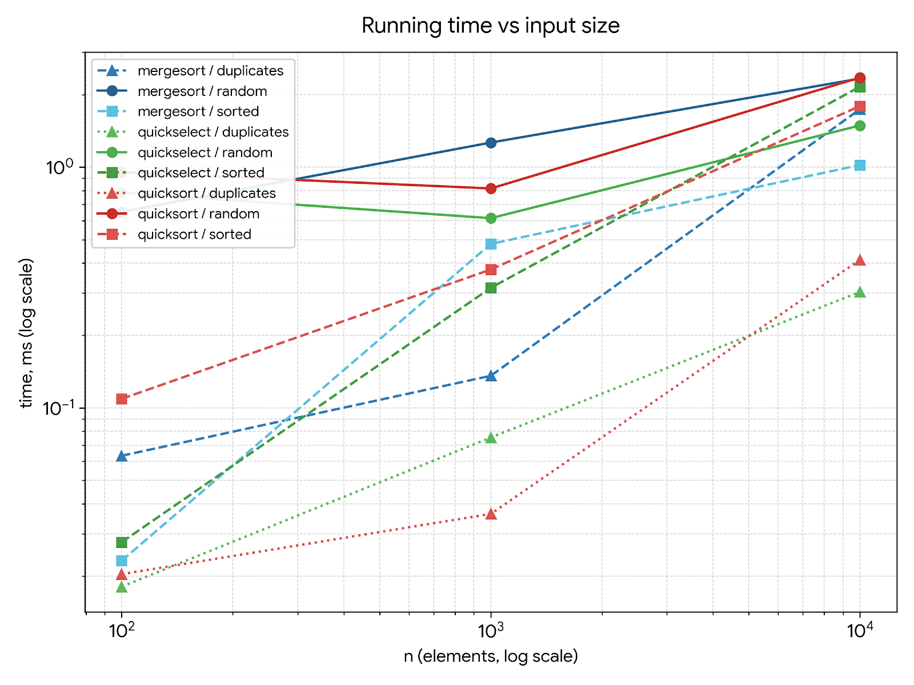

# Assignment 1: Sorting & Selection Algorithms Analysis

**Course:** Data Structures & Algorithms  
**Author:** Bakdaulet Begaliev  
**Repository:** [GitHub Repository](https://github.com/bakdauletbegaliev/sorts1)

---

## 1. Asymptotic Bounds

The following table summarizes the theoretical time complexity of **MergeSort**, **QuickSort**, **QuickSelect**, and **Insertion Sort**:

| Algorithm | Best Case | Average Case | Worst Case | Reason / Input Condition |
| :--- | :--- | :--- | :--- | :--- |
| **MergeSort** | $\Theta(n \log n)$ | $\Theta(n \log n)$ | $\Theta(n \log n)$ | Array is always divided in half and merged linearly regardless of initial order. |
| **QuickSort** | $\Theta(n \log n)$ | $\Theta(n \log n)$ | $O(n^2)$ | Best/Average on balanced partition splits; worst case occurs if pivots repeatedly select extreme values. |
| **QuickSelect** | $\Omega(n)$ | $\Theta(n)$ | $O(n^2)$ | Best/Average reduces problem size geometrically ($n + n/2 + n/4 + \dots$); worst case happens on unbalanced splits across all levels. |
| **Insertion Sort** | $\Theta(n)$ | $\Theta(n^2)$ | $\Theta(n^2)$ | Best case occurs on already sorted arrays (0 shifts); worst case occurs on reverse-sorted inputs ($n^2/2$ shifts). |

The implementation uses an Insertion Sort cutoff of 15 elements for small subarrays. This reduces recursion and function-call overhead in practice without changing the asymptotic complexity of MergeSort or QuickSort.

For QuickSort, the implementation uses a random pivot, 3-way partitioning, and smaller-side recursion. These techniques improve practical behavior and keep the recursion depth controlled.

---

## 2. Recurrence Relations & Master Theorem Analysis

The Master Theorem has the general form:

$$T(n) = a \cdot T\left(\frac{n}{b}\right) + f(n)$$

### 2.1 MergeSort
MergeSort divides the array into two halves and merges them in linear time.

* **Recurrence Relation:** $T(n) = 2T(n/2) + \Theta(n)$
* **Parameters:** $a = 2$, $b = 2$, $f(n) = \Theta(n)$
* **Master Theorem Analysis:** 
  $$n^{\log_b a} = n^{\log_2 2} = n^1 = n$$
  Since $f(n) = \Theta(n^{\log_b a}) = \Theta(n)$, this matches **Case 2** of the Master Theorem.
* **Closed-form Solution:** $T(n) = \Theta(n \log n)$.

---

### 2.2 QuickSort (Assuming Balanced Split)
For theoretical analysis, assume that the pivot divides the array into two balanced parts.

* **Recurrence Relation:** $T(n) = 2T(n/2) + \Theta(n)$
* **Parameters:** $a = 2$, $b = 2$, $f(n) = \Theta(n)$
* **Master Theorem Analysis:** 
  $$n^{\log_b a} = n^{\log_2 2} = n^1 = n$$
  This matches **Case 2** of the Master Theorem.
* **Closed-form Solution:** $T(n) = \Theta(n \log n)$.
* **Random Pivot Justification:** Selecting a random pivot reduces the probability of repeatedly obtaining highly unbalanced partitions. Randomized QuickSort has an expected runtime of $O(n \log n)$, while the theoretical worst case remains $O(n^2)$. The 3-way partition is especially useful for inputs containing many duplicate values.

---

### 2.3 QuickSelect (Assuming Balanced Split)
QuickSelect only continues in the partition containing the required position $k$.

* **Recurrence Relation:** $T(n) = 1 \cdot T(n/2) + \Theta(n)$
* **Parameters:** $a = 1$, $b = 2$, $f(n) = \Theta(n)$
* **Master Theorem Analysis:**
  $$n^{\log_b a} = n^{\log_2 1} = n^0 = 1$$
  Since $f(n) = \Theta(n) = \Omega(n^{0 + \epsilon})$ for $\epsilon = 1$, we check the regularity condition:
  $$a \cdot f(n/b) = 1 \cdot \frac{n}{2} \le c \cdot n \quad \text{for } c = \frac{1}{2} < 1$$
  This satisfies **Case 3** of the Master Theorem.
* **Closed-form Solution:** $T(n) = \Theta(f(n)) = \Theta(n)$.

QuickSelect is more efficient than a complete sorting algorithm when only one order statistic is required because it processes only one side after each partition.

---

## 3. Empirical Plots

The benchmark was performed for $n \in \{1\,000, 10\,000, 100\,000, 1\,000\,000\}$ across three input configurations: **random**, **sorted**, and **duplicates**.

### Plot 1: Execution Time vs Input Size ($n$)

The execution-time plot shows that QuickSelect generally requires less time because it does not completely sort the array. QuickSort performs particularly well on duplicate-heavy input because of 3-way partitioning.

### Plot 2: Maximum Recursion Depth vs Input Size ($n$)

MergeSort has a predictable logarithmic recursion depth. QuickSort also keeps its recursion depth controlled by recursively processing the smaller partition and handling the larger partition with a loop.

### Plot 3: Comparison Ratios vs Input Size ($n$)

* **Sorts Ratio:** $\frac{\text{comparisons}}{n \log_2 n}$
* **Select Ratio:** $\frac{\text{comparisons}}{n}$

These ratios are used to check whether the measured comparison counts behave like the expected asymptotic functions.

---

## 4. Empirical $\Theta$ Verification

By definition of asymptotic tight bound $\Theta(g(n))$, there exist positive constants $c_1$, $c_2$ and threshold $n_0$ such that:

$$c_1 \cdot g(n) \le f(n) \le c_2 \cdot g(n) \quad \forall n \ge n_0$$

The following calculations use the actual comparison counts from `results.csv`.

### 4.1 MergeSort ($g(n) = n \log_2 n$)
At $n = 1\,000\,000$:

* **Random:** $\frac{20,223,651}{1,000,000 \cdot \log_2(1,000,000)} \approx 1.013$
* **Sorted:** $\frac{8,952,320}{1,000,000 \cdot \log_2(1,000,000)} \approx 0.448$
* **Duplicates:** $\frac{19,203,312}{1,000,000 \cdot \log_2(1,000,000)} \approx 0.961$

The ratio remains bounded as $n$ increases. This supports the expected $\Theta(n \log n)$ behavior. For the tested data, a rough empirical range is:

$$0.4 \le \frac{C(n)}{n \log_2 n} \le 1.4 \quad \text{for } n \ge 1\,000$$

---

### 4.2 QuickSort ($g(n) = n \log_2 n$)
At $n = 1\,000\,000$:

* **Random:** $\frac{32,272,486}{1,000,000 \cdot \log_2(1,000,000)} \approx 1.617$
* **Sorted:** $\frac{37,334,496}{1,000,000 \cdot \log_2(1,000,000)} \approx 1.871$
* **Duplicates:** $\frac{5,398,202}{1,000,000 \cdot \log_2(1,000,000)} \approx 0.270$

The ratios remain bounded rather than increasing with $n$. The duplicate case has a much lower ratio because 3-way partitioning groups equal elements together. The measurements are consistent with the expected average-case $\Theta(n \log n)$ behavior (theoretical worst case remains $O(n^2)$).

---

### 4.3 QuickSelect ($g(n) = n$)
At $n = 1\,000\,000$:

* **Random:** $\frac{6,194,378}{1,000,000} \approx 6.19$
* **Sorted:** $\frac{4,377,279}{1,000,000} \approx 4.38$
* **Duplicates:** $\frac{3,699,970}{1,000,000} \approx 3.70$

The ratio stays within a relatively small constant range. A rough empirical range for large inputs is:

$$3.0 \le \frac{C(n)}{n} \le 7.0 \quad \text{for } n \ge 1\,000$$

This supports the expected linear average-case behavior $\Theta(n)$.

---

## 5. Summary of Benchmark Results

Below are the benchmark metrics collected at $n = 1\,000\,000$:

### Execution Time (ms)
| Algorithm | Random (ms) | Sorted (ms) | Duplicates (ms) |
| :--- | :--- | :--- | :--- |
| **MergeSort** | 173.709 | 37.646 | 90.621 |
| **QuickSort** | 158.143 | 118.276 | 20.614 |
| **QuickSelect** | 20.787 | 9.318 | 14.884 |

### Comparison Counts
| Algorithm | Random | Sorted | Duplicates |
| :--- | :--- | :--- | :--- |
| **MergeSort** | 20,223,651 | 8,952,320 | 19,203,312 |
| **QuickSort** | 32,272,486 | 37,334,496 | 5,398,202 |
| **QuickSelect** | 6,194,378 | 4,377,279 | 3,699,970 |

### Maximum Recursion Depth
| Algorithm | Random | Sorted | Duplicates |
| :--- | :--- | :--- | :--- |
| **MergeSort** | 17 | 17 | 17 |
| **QuickSort** | 11 | 14 | 2 |
| **QuickSelect** | 1 | 1 | 1 |

---

## 6. Discussion & System Impacts

The experimental measurements generally match the theoretical complexity of the algorithms:

1. **MergeSort Behavior:** Shows consistent $O(n \log n)$ behavior because it always divides the array into two parts and performs linear merging.
2. **QuickSort Enhancements:** Displays approximately $O(n \log n)$ performance on tested inputs. The 3-way partitioning makes QuickSort particularly efficient for arrays with many duplicate values.
3. **QuickSelect Efficiency:** Faster than sorting algorithms because it processes only the partition containing the target element.
4. **JVM Warm-up & JIT:** Execution times in early benchmark runs can display higher latency until the Just-In-Time (JIT) compiler optimizes hot code paths.
5. **Garbage Collection (GC):** Auxiliary buffer allocations in MergeSort increase memory management overhead relative to QuickSort's in-place operations.
6. **CPU Cache Locality:** QuickSort operates directly in-place, offering better spatial cache locality compared to MergeSort's extra array copying.
7. **Insertion Cutoff:** Applying Insertion Sort for subarrays with $n \le 15$ suppresses function-call overhead without altering asymptotic complexity.

---

## 7. Conclusion

The benchmark results support the theoretical analysis of the implemented algorithms. MergeSort demonstrates predictable $\Theta(n \log n)$ behavior across all input types. QuickSort shows expected $\Theta(n \log n)$ behavior, while random pivot selection and smaller-side recursion keep its recursion depth controlled. Its 3-way partitioning is especially effective when duplicate values are present. QuickSelect demonstrates linear comparison growth because it processes only one partition after each step. Practical execution time depends on factors such as JVM warm-up, memory allocation, CPU cache behavior, and insertion-sort cutoff. Overall, the implementation satisfies the core requirements, and empirical results align with expected asymptotic bounds.
